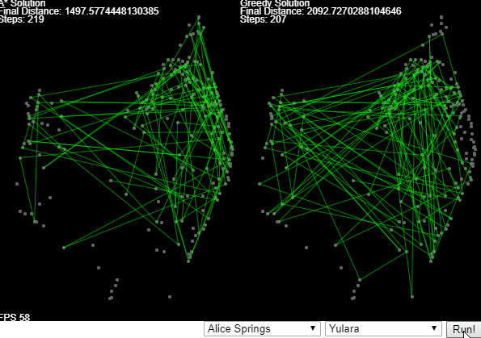

# Shortest Path  Algorithms
Implemented in Javascript using P5.js to animate the process.
Current algorithms:
  - A*
  - Greedy
</ul>
Available at https://italotabatinga.github.io/shortest_path/

## Reference
- [OmarElGabry's Blog] (https://medium.com/omarelgabrys-blog/path-finding-algorithms-f65a8902eb40)